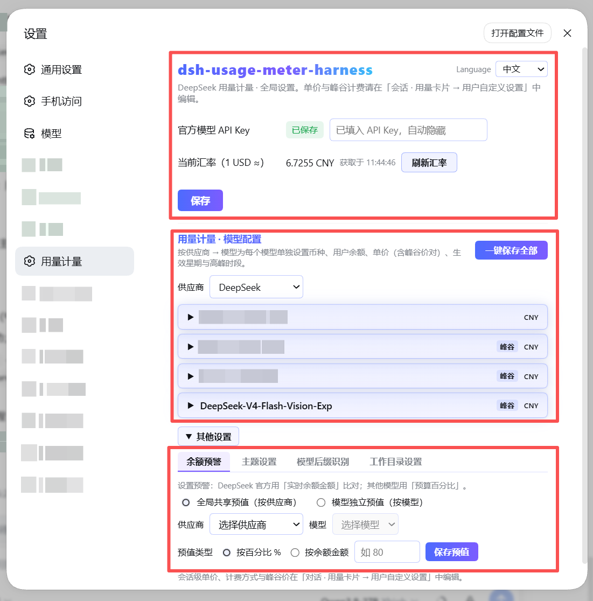
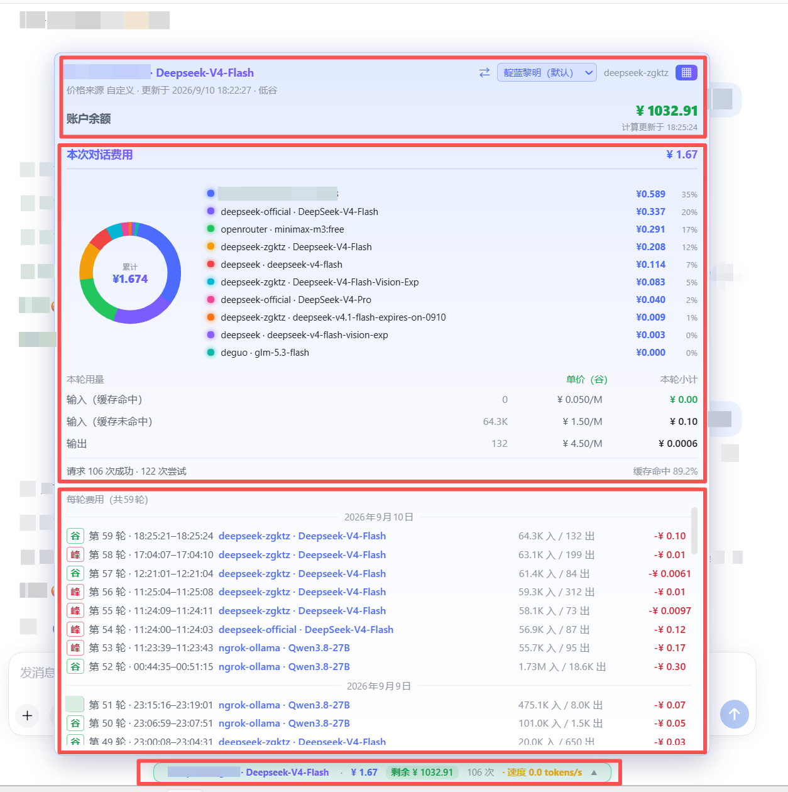

# dsh-usage-meter-harness

[English](README.md) | [简体中文](README.zh-CN.md)

A real-time usage / cost / balance meter plugin for **DeepSeek Harness (DSH)**.
See tokens, spending and real wallet balance right next to the chat input — for
the official DeepSeek models **and** any custom model registered in DSH.



## Install

> Prerequisite (methods 1 & 2): the DSH CLI itself runs on pnpm — install it once per machine:
> `npm install -g pnpm` (or `corepack enable`), then verify with `pnpm --version`.

Pick one of the three methods. **Methods 1 and 2 need pnpm** (a one-time machine
setup used by the DSH CLI itself): `npm install -g pnpm` or `corepack enable`.

### Method 1 — npm registry via DSH CLI (needs pnpm)

```bash
dsh plugin --profile web add --verbose @faith1688/dsh-usage-meter-harness
```

(`--verbose` shows the install progress; drop it if you prefer a quiet install.)

### Method 2 — GitHub via DSH CLI (needs pnpm)

```bash
dsh plugin --profile web add --verbose github:faith1688/dsh-usage-meter-harness
```

(`--verbose` shows the install progress.)

### Method 3 — one-line installer, no pnpm (recommended)

`ash
npx -y @faith1688/dsh-usage-meter-harness
`

One command: installs into the DSH web profile and registers the bundle (idempotent).

Prefer not to use npx? The same logic ships as scripts in the repo:

Windows (cmd):

```bat
curl -fsSL https://raw.githubusercontent.com/faith1688/dsh-usage-meter-harness/main/scripts/install.cmd -o "%TEMP%\um-install.cmd" && "%TEMP%\um-install.cmd"
```

Linux / macOS:

```bash
curl -fsSL https://raw.githubusercontent.com/faith1688/dsh-usage-meter-harness/main/scripts/install.sh | sh
```

The script does everything for you: `cd` into the DSH web profile, installs the
package with visible progress, and registers the bundle in `dsh.profile.bundles`
(idempotent — safe to re-run after upgrades).

After any method: **restart `dsh web`**.

## Features

### Conversation usage card (next to the chat input)

| Feature | Description |
| --- | --- |
| Live cost | Session cost in CNY or USD, updated every step |
| Token breakdown | Input (miss) / cache hit / cache write / output |
| Turn usage panel | Per-turn subtotals with unit prices tagged peak/off-peak |
| Token speed | Live tokens/s while streaming; resets cleanly when output stops or tools run |
| Cache hit rate | Share of cached tokens for the session |
| Account balance | Real DeepSeek wallet balance; local-ledger estimate for other providers |
| Budget & remaining | Set a budget, see used / remaining / over-budget |

### Billing engine

| Feature | Description |
| --- | --- |
| 6 billing templates | Basic · Cache hit/miss · Peak/off-peak (DeepSeek official hours) · Cache write+hit · Combined input+output · Batch half price |
| Custom price rows | Up to 4 user-defined rows; the popup mirrors your setup verbatim |
| Peak/off-peak billing | Beijing-time weekday + hour windows, cross-midnight supported; each request is billed by its start time |
| Per-model pricing | Currency (CNY/USD), unit prices and balance per model |
| Shared provider wallet | One balance shared by all models of a provider — single checkbox |
| Official price prefill | DeepSeek official models come pre-filled with official prices and the official peak schedule |
| Built-in price table | 137 models across 19 vendors bundled; optional LiteLLM-shaped remote price source |
| Exchange rate | USD→CNY fetched automatically, refreshed when older than 24 h |
| Legacy migration | Old manual initial-balance/top-up settings migrate into provider wallets automatically |

### Settings & UX

| Feature | Description |
| --- | --- |
| Bilingual UI | 中文 / English switch at the top-right of the settings page; applies everywhere instantly (popup included). Display only — saved data never changes |
| In-use lock | While a model is generating, its editor is locked so a running turn keeps consistent prices |
| WYSIWYG popup | Usage-card rows are copied verbatim from your template selection |
| Non-intrusive | Standard DSH cordis plugin; touches no other plugin and no DSH core files |

## Supported models

- **DeepSeek official models** (`deepseek-chat`, `deepseek-reasoner`, …): official
  prices pre-filled; real wallet balance via API Key.
- **Any custom model** registered in DSH (OpenAI-compatible providers, Ollama,
  OpenRouter, …): set unit prices and balance yourself; everything else works the same.

## Screenshots

Settings page:


Usage popup:



## Configuration

All settings live in the `usage-meter` settings namespace and can be edited
directly in the plugin UI:

| Key | Type | Default | Description |
| --- | --- | --- | --- |
| `currency` | string | `CNY` | Display currency |
| `budget` | number | – | Session budget; shows "remaining" when set |
| `priceSourceUrl` | string | – | LiteLLM-shaped price JSON URL; optional |
| `refreshIntervalMs` | number | 4 h | Price / balance / rate refresh interval |
| `deepseekApiKey` | secret | – | Only used to query the DeepSeek balance; `DEEPSEEK_API_KEY` env also works |

## Compatibility

- Node.js ≥ 22.
- Peer versions track the supported DSH releases (see `package.json`); updating
  DSH does not break the plugin, and it never modifies your other plugins.

## License

MIT © [faith1688](https://github.com/faith1688)

## Privacy

- The plugin makes **no telemetry and no analytics calls**.
- Network requests are limited to two optional ones: querying the **official
  DeepSeek balance API** with the API key you configure yourself, and fetching a
  public USD→CNY exchange rate. Nothing else leaves your machine.
- The source is MIT-licensed and fully readable on GitHub.
